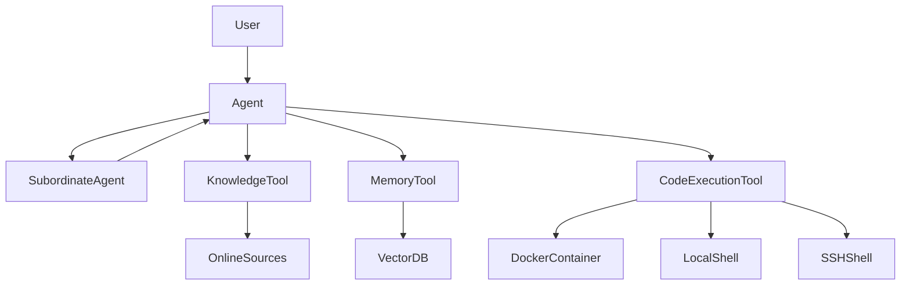

# Architecture Document for Agent Zero

## HIGH LEVEL UNDERSTANDING

Agent Zero is a dynamic AI framework designed to act as a personal assistant capable of executing tasks through a combination of online knowledge tools and local execution capabilities. The architecture is modular, allowing for the integration of various AI models and tools while maintaining a clear communication structure between agents.

### Overall Architecture



### Data Flow
1. The **User** interacts with the **Agent** to request tasks.
2. The **Agent** can delegate tasks to **Subordinate Agents** or utilize **Knowledge Tools** and **Memory Tools** to gather information.
3. The **Knowledge Tool** fetches data from online sources, while the **Memory Tool** accesses a vector database for stored memories.
4. The **Code Execution Tool** can execute code in a controlled environment using Docker, local shells, or SSH sessions.
5. Results are communicated back to the user through the **Agent**.

## TECHNOLOGY STACK

- **Programming Language**: Python
- **Frameworks**: LangChain, Docker
- **Libraries**:
  - `langchain-community`
  - `langchain-openai`
  - `langchain-anthropic`
  - `langchain-groq`
  - `langchain-huggingface`
  - `duckduckgo_search`
  - `python-dotenv`
- **Database**: VectorDB for memory management
- **APIs**: OpenAI, Anthropic, Groq, Google Generative AI, Perplexity
- **Development Tools**: Docker, Paramiko for SSH, ansio for asynchronous input handling

## DESIGN DECISIONS

1. **Dynamic Agent Framework**: The decision to create a dynamic, customizable agent allows users to adapt the framework to their specific needs without hardcoding behaviors.
2. **Multi-Agent Architecture**: The use of subordinate agents enables task delegation, which helps in managing complex tasks by breaking them down into smaller subtasks.
3. **Tool Integration**: The framework integrates various tools (knowledge, memory, code execution) that can be utilized based on the task requirements, enhancing flexibility.
4. **Environment Isolation**: Using Docker for code execution ensures that the agent operates in a controlled environment, minimizing risks associated with executing arbitrary code.
5. **Prompt-Based Communication**: The system relies on structured prompts to guide agent behavior, allowing for easy modifications and extensions of functionalities.

## GETTING STARTED

To use Agent Zero, follow these steps:

1. **Clone the Repository**:
   ```bash
   git clone https://github.com/frdel/agent-zero.git
   cd agent-zero
   ```

2. **Set Up Environment Variables**:
   - Copy the example environment file:
     ```bash
     cp example.env .env
     ```
   - Fill in the required API keys in the `.env` file.

3. **Install Dependencies**:
   ```bash
   pip install -r requirements.txt
   ```

4. **Run the Application**:
   ```bash
   python main.py
   ```

5. **Interact with the Agent**: Follow the prompts in the terminal to communicate with the agent.

## ENTRY POINTS

- **main.py**: The main entry point for executing the application. This file initializes the agent and starts the conversation loop.
- **agent.py**: Contains the core logic for the Agent class, handling message loops and tool interactions.
- **models.py**: Defines the model factory functions to create instances of various AI models used by the agent.

## COMPONENTS

### Agent
- **Purpose**: Manages the overall behavior of the agent, including task execution and communication.
- **Key Data Structures**: Uses a history list to store conversation history and a rate limiter for API calls.
- **Design Patterns**: Implements the Command pattern for handling tool execution.
- **Architectural Invariants**: Ensures that all interactions are logged and that the agent maintains context across conversations.

### Knowledge Tool
- **Purpose**: Gathers information from online sources and memory.
- **Key Data Structures**: Utilizes threading for concurrent searches.
- **Design Patterns**: Uses the Strategy pattern to decide which search method to use (e.g., Perplexity, DuckDuckGo).
- **Architectural Invariants**: Always checks for API keys before executing searches.

### Memory Tool
- **Purpose**: Manages long-term memory, enabling the agent to recall past interactions.
- **Key Data Structures**: VectorDB for storing and retrieving memories.
- **Design Patterns**: Implements the Repository pattern for managing memory storage.
- **Architectural Invariants**: Ensures that memory queries respect thresholds for relevancy.

### Code Execution Tool
- **Purpose**: Executes code in various environments (local, Docker, SSH).
- **Key Data Structures**: Maintains state for the execution environment.
- **Design Patterns**: Uses the Factory pattern to create execution environments based on configuration.
- **Architectural Invariants**: Validates code before execution to prevent errors.

## CODE MAP

- **/agent.py**: Core agent logic and message handling.
- **/models.py**: Model factory functions for AI models.
- **/python/tools/**: Contains various tool implementations used by the agent.
- **/python/helpers/**: Utility functions and classes for common tasks.
- **/prompts/**: Contains prompt templates that guide agent behavior.

## CROSS CUTTING CONCERNS

### Build Tool and Release Management
- Uses `pip` for dependency management.
- Docker is used to create isolated environments for execution.

### Testing Strategies and Methods
- Unit tests can be implemented for individual tools and agent functionalities.
- Integration tests to ensure that the agent interacts correctly with external APIs.

### Error Handling Strategies
- Errors are captured and formatted using a dedicated error handling module.
- The agent can respond to errors by informing the user and attempting to recover.

### Observability Features and Performance Metrics
- Logging of interactions and outputs is implemented to track agent behavior.
- Performance metrics can be added to monitor API usage and execution times.

## Thank You

Thank you for considering Agent Zero for your AI needs. We hope that this framework empowers you to create dynamic and responsive AI agents tailored to your specific requirements. Happy coding!